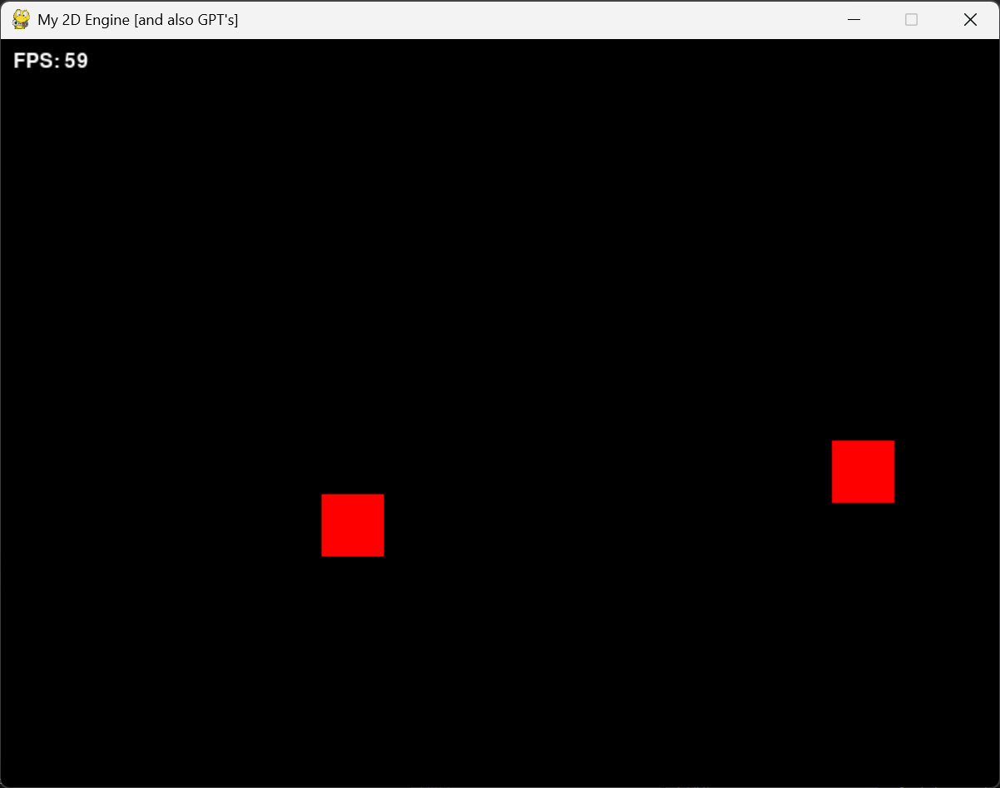

# Pylon (2D Python Engine)

this python engine is still under heavy beta and is on hiatus (sike NO MORE HIATUS!!!!), this README is here for the sake of moving to github, anyways this is just a 2D python game engine and nothing else, also built by chatgpt and also me

## results.png

## singleplayer.png

theres another red cube because its the AI system (really simple one) that is working in the src/AIBehavior folder.
